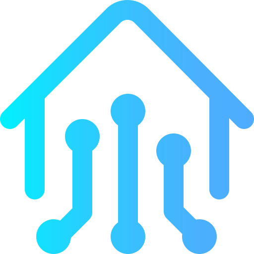

# ZASH (Zero-Aware Smart Home)

<p align="center">
  
</p>

Although smart homes have become popular recently, people are still highly concerned about **security, safety, and privacy issues**. Studies revealed that issues in people’s privacy generate physiological and financial harm because smart homes are intimate living environments. Further, our research disclosed that **impersonation attacks** are one of the most severe threats against smart homes because they compromise **confidentiality, authenticity, integrity, and non-repudiation**. 

Typically, approaches to build security for Smart Home Systems (SHS) require historical data to implement access control and Intrusion Detection Systems (IDS), a vulnerability to the inhabitant’s privacy. Additionally, most works rely on cloud computing or resources in the cloud to perform security tasks, which attackers can exploit to target confidentiality, integrity, and availability. Moreover, researchers do not regard the misuse of SHS by forcing users to interact with devices through their smartphones or tablets, as they usually interact by any means, like virtual assistants and devices themselves. Therefore, the security system requirements for smart homes should comprehend **privacy perception, low latency in response, spatial and temporal locality, device extensibility, protection against impersonation, device isolation, access control enforcement, and taking into account the refresh verification with a trustworthy system**. 

To attend to those requirements, we propose the **ZASH (Zero-Aware Smart Home)** system to provide access control for the user’s actions on smart devices in smart homes. In contrast to current works, it leverages **continuous authentication with the Zero Trust paradigm supported by configured ontologies, real-time context, and user activity**. Edge computing and Markov Chain enable ZASH to prevent and mitigate impersonation attacks that aim to compromise users’ security. The system relies only on resources inside the house, is self-sufficient, and is less exposed to outside exploitation. Furthermore, it works from day zero without the requirement of historical data, though it counts on that as time passes to monitor the users’ behavior. ZASH requires proof of identity for users to confirm their authenticity through strong features of the Something You Are class. The system enforces access control in smart devices, so it does not depend on intermediaries and considers any user-device interaction. 

At first, an initial test of algorithms with a synthetic dataset demonstrated the system’s capability to dynamically adapt to new users’ behaviors withal blocking impersonation attacks. Finally, we implemented ZASH in the ns-3 network simulator and analyzed its robustness, efficiency, extensibility, and performance. According to our analysis, it **protects users’ privacy, responds quickly (around 4.16 ms), copes with adding and removing devices, blocks most impersonation attacks (up to 99% with a proper configuration), isolates smart devices, and enforces access control for all interactions**.





## Accomplishments

1. A thorough exploration of SHS security requirements, with a detailed comparison to existing works; 
2. An in-depth presentation of ZASH, detailing its operation within a smart home network, including communication protocols, server and client state machines, and operational nuances;
3. A robust evaluation utilizing eight metrics to assess ZASH's efficiency, extensibility, and performance, including its impact on user privacy, system reliability, access control response time, device extensibility, resistance to impersonation attacks, device isolation, and access control enforcement. Our analysis incorporates scenarios with diverse rules, attack frequencies, network conditions, users, and devices.


## Team

- Giovanni Rosa da Silva
-  [Aldri Luiz dos Santos](https://homepages.dcc.ufmg.br/~aldri/)

# Code

Copyright 2024 Giovanni Rosa da Silva

Permission is hereby granted, free of charge, to any person obtaining a copy of this software and associated documentation files (the “Software”), to deal in the Software without restriction, including without limitation the rights to use, copy, modify, merge, publish, distribute, sublicense, and/or sell copies of the Software, and to permit persons to whom the Software is furnished to do so, subject to the following conditions:

The above copyright notice and this permission notice shall be included in all copies or substantial portions of the Software.

THE SOFTWARE IS PROVIDED “AS IS”, WITHOUT WARRANTY OF ANY KIND, EXPRESS OR IMPLIED, INCLUDING BUT NOT LIMITED TO THE WARRANTIES OF MERCHANTABILITY, FITNESS FOR A PARTICULAR PURPOSE AND NONINFRINGEMENT. IN NO EVENT SHALL THE AUTHORS OR COPYRIGHT HOLDERS BE LIABLE FOR ANY CLAIM, DAMAGES OR OTHER LIABILITY, WHETHER IN AN ACTION OF CONTRACT, TORT OR OTHERWISE, ARISING FROM, OUT OF OR IN CONNECTION WITH THE SOFTWARE OR THE USE OR OTHER DEALINGS IN THE SOFTWARE.

## Execution

The requirement to run the simulation is [ns-3 3.36.1](https://www.nsnam.org/releases/ns-3-36/). Follow the instructions on the official website to install and configure ns-3.

There are two scripts to help execute the code:
1. replace.sh: copy necessary files from this repository to the ns-3 directory.
2. run.sh: execute the system with the necessary parameters

While and after executing the simulation, logs are generated under zash_traces/ in the date and time it started.

It's possible to visualize data using the chart's R scripts. For that, I recommend using [R Studio](https://posit.co/download/rstudio-desktop/).

# Paper

For more information and details about this work, please refer to the [dissertation](./assets/dissertation.pdf).

## Publications

[SBSEG 2021 (da Silva et al., 2021)](https://sol.sbc.org.br/index.php/sbseg/article/view/17305): publication of the article "Zero Trust Access Control with Context-Aware and Behavior-Based Continuous Authentication for Smart Homes", authors Giovanni Silva, Daniel Macedo, and Aldri Santos.

## Citing us

We encourage you to cite our project if you have used them in your work. You can use the following BibTeX citation:

```
@misc{zash,
  author       = {Giovanni Silva, and Aldri Santos},
  title        = {ZASH},
  howpublished = {\url{https://giovannirosa.github.io/zash-ns-3}},
  month        = feb,
  year         = 2024}
```
